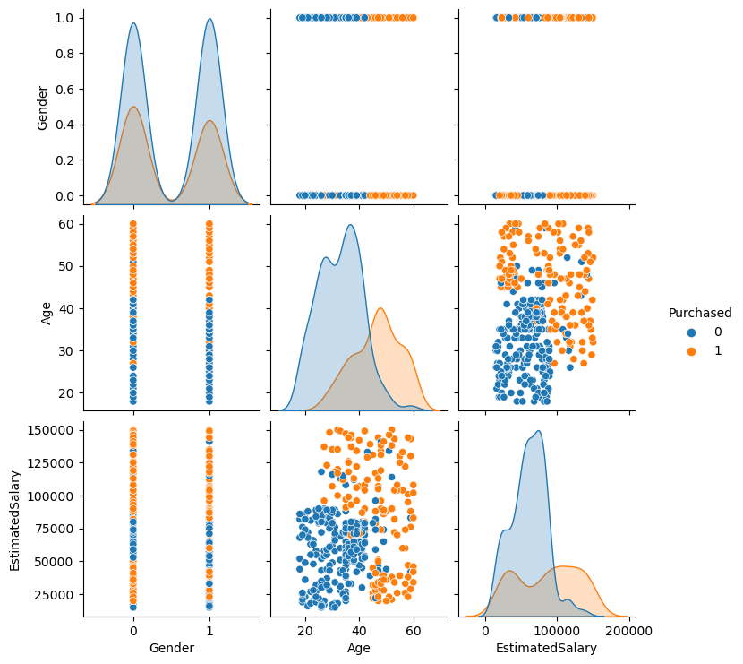
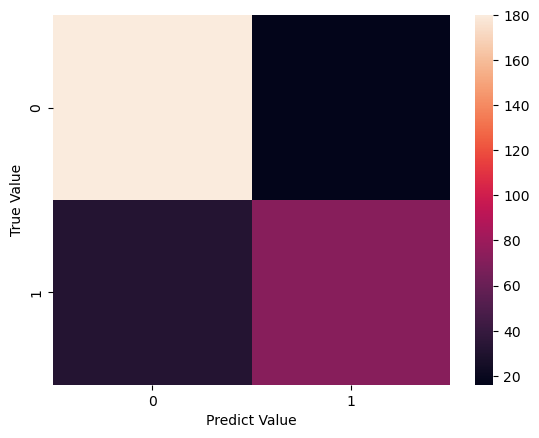
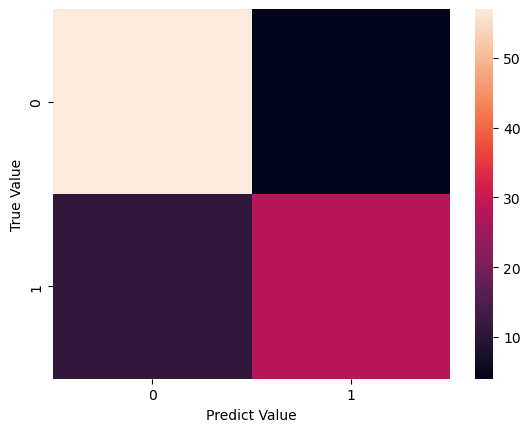
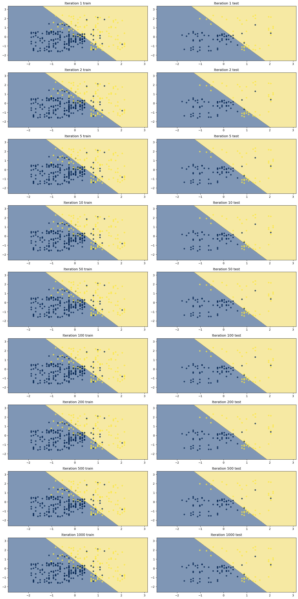
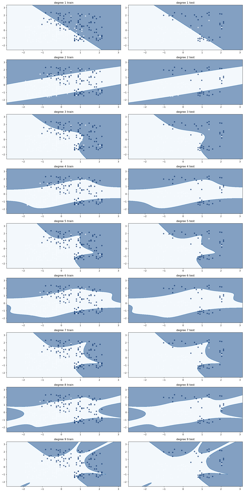
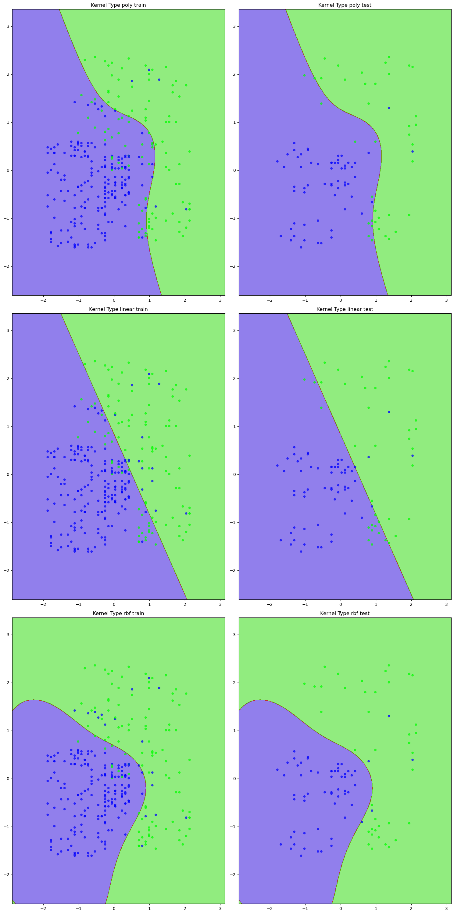

# Import the libraries


```python
import pandas as pd
import numpy as np 
import matplotlib.pyplot as plt
import seaborn as sns
```


```python
df = pd.read_csv("Social_Network_Ads.csv")
```


```python
df
```


<div>
<style scoped>
    .dataframe tbody tr th:only-of-type {
        vertical-align: middle;
    }

    .dataframe tbody tr th {
        vertical-align: top;
    }

    .dataframe thead th {
        text-align: right;
    }
</style>
<table border="1" class="dataframe">
  <thead>
    <tr style="text-align: right;">
      <th></th>
      <th>User ID</th>
      <th>Gender</th>
      <th>Age</th>
      <th>EstimatedSalary</th>
      <th>Purchased</th>
    </tr>
  </thead>
  <tbody>
    <tr>
      <th>0</th>
      <td>15624510</td>
      <td>Male</td>
      <td>19</td>
      <td>19000</td>
      <td>0</td>
    </tr>
    <tr>
      <th>1</th>
      <td>15810944</td>
      <td>Male</td>
      <td>35</td>
      <td>20000</td>
      <td>0</td>
    </tr>
    <tr>
      <th>2</th>
      <td>15668575</td>
      <td>Female</td>
      <td>26</td>
      <td>43000</td>
      <td>0</td>
    </tr>
    <tr>
      <th>3</th>
      <td>15603246</td>
      <td>Female</td>
      <td>27</td>
      <td>57000</td>
      <td>0</td>
    </tr>
    <tr>
      <th>4</th>
      <td>15804002</td>
      <td>Male</td>
      <td>19</td>
      <td>76000</td>
      <td>0</td>
    </tr>
    <tr>
      <th>...</th>
      <td>...</td>
      <td>...</td>
      <td>...</td>
      <td>...</td>
      <td>...</td>
    </tr>
    <tr>
      <th>395</th>
      <td>15691863</td>
      <td>Female</td>
      <td>46</td>
      <td>41000</td>
      <td>1</td>
    </tr>
    <tr>
      <th>396</th>
      <td>15706071</td>
      <td>Male</td>
      <td>51</td>
      <td>23000</td>
      <td>1</td>
    </tr>
    <tr>
      <th>397</th>
      <td>15654296</td>
      <td>Female</td>
      <td>50</td>
      <td>20000</td>
      <td>1</td>
    </tr>
    <tr>
      <th>398</th>
      <td>15755018</td>
      <td>Male</td>
      <td>36</td>
      <td>33000</td>
      <td>0</td>
    </tr>
    <tr>
      <th>399</th>
      <td>15594041</td>
      <td>Female</td>
      <td>49</td>
      <td>36000</td>
      <td>1</td>
    </tr>
  </tbody>
</table>
<p>400 rows × 5 columns</p>
</div>


# EDA


```python
df.isna().sum()
```


    User ID            0
    Gender             0
    Age                0
    EstimatedSalary    0
    Purchased          0
    dtype: int64


Not have messing values


```python
df = df.drop("User ID" , axis=1)
```


```python
df
```


<div>
<style scoped>
    .dataframe tbody tr th:only-of-type {
        vertical-align: middle;
    }

    .dataframe tbody tr th {
        vertical-align: top;
    }

    .dataframe thead th {
        text-align: right;
    }
</style>
<table border="1" class="dataframe">
  <thead>
    <tr style="text-align: right;">
      <th></th>
      <th>Gender</th>
      <th>Age</th>
      <th>EstimatedSalary</th>
      <th>Purchased</th>
    </tr>
  </thead>
  <tbody>
    <tr>
      <th>0</th>
      <td>Male</td>
      <td>19</td>
      <td>19000</td>
      <td>0</td>
    </tr>
    <tr>
      <th>1</th>
      <td>Male</td>
      <td>35</td>
      <td>20000</td>
      <td>0</td>
    </tr>
    <tr>
      <th>2</th>
      <td>Female</td>
      <td>26</td>
      <td>43000</td>
      <td>0</td>
    </tr>
    <tr>
      <th>3</th>
      <td>Female</td>
      <td>27</td>
      <td>57000</td>
      <td>0</td>
    </tr>
    <tr>
      <th>4</th>
      <td>Male</td>
      <td>19</td>
      <td>76000</td>
      <td>0</td>
    </tr>
    <tr>
      <th>...</th>
      <td>...</td>
      <td>...</td>
      <td>...</td>
      <td>...</td>
    </tr>
    <tr>
      <th>395</th>
      <td>Female</td>
      <td>46</td>
      <td>41000</td>
      <td>1</td>
    </tr>
    <tr>
      <th>396</th>
      <td>Male</td>
      <td>51</td>
      <td>23000</td>
      <td>1</td>
    </tr>
    <tr>
      <th>397</th>
      <td>Female</td>
      <td>50</td>
      <td>20000</td>
      <td>1</td>
    </tr>
    <tr>
      <th>398</th>
      <td>Male</td>
      <td>36</td>
      <td>33000</td>
      <td>0</td>
    </tr>
    <tr>
      <th>399</th>
      <td>Female</td>
      <td>49</td>
      <td>36000</td>
      <td>1</td>
    </tr>
  </tbody>
</table>
<p>400 rows × 4 columns</p>
</div>


```python
from sklearn.preprocessing import LabelEncoder
```


```python
df['Gender'] = LabelEncoder().fit_transform(df['Gender'])
```


```python
df
```


<div>
<style scoped>
    .dataframe tbody tr th:only-of-type {
        vertical-align: middle;
    }

    .dataframe tbody tr th {
        vertical-align: top;
    }

    .dataframe thead th {
        text-align: right;
    }
</style>
<table border="1" class="dataframe">
  <thead>
    <tr style="text-align: right;">
      <th></th>
      <th>Gender</th>
      <th>Age</th>
      <th>EstimatedSalary</th>
      <th>Purchased</th>
    </tr>
  </thead>
  <tbody>
    <tr>
      <th>0</th>
      <td>1</td>
      <td>19</td>
      <td>19000</td>
      <td>0</td>
    </tr>
    <tr>
      <th>1</th>
      <td>1</td>
      <td>35</td>
      <td>20000</td>
      <td>0</td>
    </tr>
    <tr>
      <th>2</th>
      <td>0</td>
      <td>26</td>
      <td>43000</td>
      <td>0</td>
    </tr>
    <tr>
      <th>3</th>
      <td>0</td>
      <td>27</td>
      <td>57000</td>
      <td>0</td>
    </tr>
    <tr>
      <th>4</th>
      <td>1</td>
      <td>19</td>
      <td>76000</td>
      <td>0</td>
    </tr>
    <tr>
      <th>...</th>
      <td>...</td>
      <td>...</td>
      <td>...</td>
      <td>...</td>
    </tr>
    <tr>
      <th>395</th>
      <td>0</td>
      <td>46</td>
      <td>41000</td>
      <td>1</td>
    </tr>
    <tr>
      <th>396</th>
      <td>1</td>
      <td>51</td>
      <td>23000</td>
      <td>1</td>
    </tr>
    <tr>
      <th>397</th>
      <td>0</td>
      <td>50</td>
      <td>20000</td>
      <td>1</td>
    </tr>
    <tr>
      <th>398</th>
      <td>1</td>
      <td>36</td>
      <td>33000</td>
      <td>0</td>
    </tr>
    <tr>
      <th>399</th>
      <td>0</td>
      <td>49</td>
      <td>36000</td>
      <td>1</td>
    </tr>
  </tbody>
</table>
<p>400 rows × 4 columns</p>
</div>


Incode DataFrame To Transform male or female to 1/0


```python
sns.pairplot(df , hue="Purchased")
plt.show()
```

    C:\Users\motal\anaconda3\Lib\site-packages\seaborn\axisgrid.py:118: UserWarning: The figure layout has changed to tight
      self._figure.tight_layout(*args, **kwargs)
    


    

    


Have a seperate between data with Estimated salary and age

# Prepare Data For Training


```python
x=df.iloc[: , :-1]
```


```python
x
```


<div>
<style scoped>
    .dataframe tbody tr th:only-of-type {
        vertical-align: middle;
    }

    .dataframe tbody tr th {
        vertical-align: top;
    }

    .dataframe thead th {
        text-align: right;
    }
</style>
<table border="1" class="dataframe">
  <thead>
    <tr style="text-align: right;">
      <th></th>
      <th>Gender</th>
      <th>Age</th>
      <th>EstimatedSalary</th>
    </tr>
  </thead>
  <tbody>
    <tr>
      <th>0</th>
      <td>1</td>
      <td>19</td>
      <td>19000</td>
    </tr>
    <tr>
      <th>1</th>
      <td>1</td>
      <td>35</td>
      <td>20000</td>
    </tr>
    <tr>
      <th>2</th>
      <td>0</td>
      <td>26</td>
      <td>43000</td>
    </tr>
    <tr>
      <th>3</th>
      <td>0</td>
      <td>27</td>
      <td>57000</td>
    </tr>
    <tr>
      <th>4</th>
      <td>1</td>
      <td>19</td>
      <td>76000</td>
    </tr>
    <tr>
      <th>...</th>
      <td>...</td>
      <td>...</td>
      <td>...</td>
    </tr>
    <tr>
      <th>395</th>
      <td>0</td>
      <td>46</td>
      <td>41000</td>
    </tr>
    <tr>
      <th>396</th>
      <td>1</td>
      <td>51</td>
      <td>23000</td>
    </tr>
    <tr>
      <th>397</th>
      <td>0</td>
      <td>50</td>
      <td>20000</td>
    </tr>
    <tr>
      <th>398</th>
      <td>1</td>
      <td>36</td>
      <td>33000</td>
    </tr>
    <tr>
      <th>399</th>
      <td>0</td>
      <td>49</td>
      <td>36000</td>
    </tr>
  </tbody>
</table>
<p>400 rows × 3 columns</p>
</div>


```python
y = df.iloc[: , -1]
```


```python
y
```


    0      0
    1      0
    2      0
    3      0
    4      0
          ..
    395    1
    396    1
    397    1
    398    0
    399    1
    Name: Purchased, Length: 400, dtype: int64


Scaled The Data 


```python
from sklearn.preprocessing import StandardScaler
```


```python
scl = StandardScaler()
```


```python
x_scl = scl.fit_transform(x)
```


```python
x_scl
```


    array([[ 1.02020406, -1.78179743, -1.49004624],
           [ 1.02020406, -0.25358736, -1.46068138],
           [-0.98019606, -1.11320552, -0.78528968],
           ...,
           [-0.98019606,  1.17910958, -1.46068138],
           [ 1.02020406, -0.15807423, -1.07893824],
           [-0.98019606,  1.08359645, -0.99084367]])


# Split the Data


```python
from sklearn.model_selection import train_test_split
```


```python
x_train , x_test , y_train , y_test = train_test_split(x_scl , y , test_size=0.25 , shuffle=True)
```

# Train The Model


```python
from sklearn.linear_model import LogisticRegression
```


```python
classifier = LogisticRegression()
```


```python
classifier.fit(x_train , y_train)
```


<style>#sk-container-id-1 {color: black;}#sk-container-id-1 pre{padding: 0;}#sk-container-id-1 div.sk-toggleable {background-color: white;}#sk-container-id-1 label.sk-toggleable__label {cursor: pointer;display: block;width: 100%;margin-bottom: 0;padding: 0.3em;box-sizing: border-box;text-align: center;}#sk-container-id-1 label.sk-toggleable__label-arrow:before {content: "▸";float: left;margin-right: 0.25em;color: #696969;}#sk-container-id-1 label.sk-toggleable__label-arrow:hover:before {color: black;}#sk-container-id-1 div.sk-estimator:hover label.sk-toggleable__label-arrow:before {color: black;}#sk-container-id-1 div.sk-toggleable__content {max-height: 0;max-width: 0;overflow: hidden;text-align: left;background-color: #f0f8ff;}#sk-container-id-1 div.sk-toggleable__content pre {margin: 0.2em;color: black;border-radius: 0.25em;background-color: #f0f8ff;}#sk-container-id-1 input.sk-toggleable__control:checked~div.sk-toggleable__content {max-height: 200px;max-width: 100%;overflow: auto;}#sk-container-id-1 input.sk-toggleable__control:checked~label.sk-toggleable__label-arrow:before {content: "▾";}#sk-container-id-1 div.sk-estimator input.sk-toggleable__control:checked~label.sk-toggleable__label {background-color: #d4ebff;}#sk-container-id-1 div.sk-label input.sk-toggleable__control:checked~label.sk-toggleable__label {background-color: #d4ebff;}#sk-container-id-1 input.sk-hidden--visually {border: 0;clip: rect(1px 1px 1px 1px);clip: rect(1px, 1px, 1px, 1px);height: 1px;margin: -1px;overflow: hidden;padding: 0;position: absolute;width: 1px;}#sk-container-id-1 div.sk-estimator {font-family: monospace;background-color: #f0f8ff;border: 1px dotted black;border-radius: 0.25em;box-sizing: border-box;margin-bottom: 0.5em;}#sk-container-id-1 div.sk-estimator:hover {background-color: #d4ebff;}#sk-container-id-1 div.sk-parallel-item::after {content: "";width: 100%;border-bottom: 1px solid gray;flex-grow: 1;}#sk-container-id-1 div.sk-label:hover label.sk-toggleable__label {background-color: #d4ebff;}#sk-container-id-1 div.sk-serial::before {content: "";position: absolute;border-left: 1px solid gray;box-sizing: border-box;top: 0;bottom: 0;left: 50%;z-index: 0;}#sk-container-id-1 div.sk-serial {display: flex;flex-direction: column;align-items: center;background-color: white;padding-right: 0.2em;padding-left: 0.2em;position: relative;}#sk-container-id-1 div.sk-item {position: relative;z-index: 1;}#sk-container-id-1 div.sk-parallel {display: flex;align-items: stretch;justify-content: center;background-color: white;position: relative;}#sk-container-id-1 div.sk-item::before, #sk-container-id-1 div.sk-parallel-item::before {content: "";position: absolute;border-left: 1px solid gray;box-sizing: border-box;top: 0;bottom: 0;left: 50%;z-index: -1;}#sk-container-id-1 div.sk-parallel-item {display: flex;flex-direction: column;z-index: 1;position: relative;background-color: white;}#sk-container-id-1 div.sk-parallel-item:first-child::after {align-self: flex-end;width: 50%;}#sk-container-id-1 div.sk-parallel-item:last-child::after {align-self: flex-start;width: 50%;}#sk-container-id-1 div.sk-parallel-item:only-child::after {width: 0;}#sk-container-id-1 div.sk-dashed-wrapped {border: 1px dashed gray;margin: 0 0.4em 0.5em 0.4em;box-sizing: border-box;padding-bottom: 0.4em;background-color: white;}#sk-container-id-1 div.sk-label label {font-family: monospace;font-weight: bold;display: inline-block;line-height: 1.2em;}#sk-container-id-1 div.sk-label-container {text-align: center;}#sk-container-id-1 div.sk-container {/* jupyter's `normalize.less` sets `[hidden] { display: none; }` but bootstrap.min.css set `[hidden] { display: none !important; }` so we also need the `!important` here to be able to override the default hidden behavior on the sphinx rendered scikit-learn.org. See: https://github.com/scikit-learn/scikit-learn/issues/21755 */display: inline-block !important;position: relative;}#sk-container-id-1 div.sk-text-repr-fallback {display: none;}</style><div id="sk-container-id-1" class="sk-top-container"><div class="sk-text-repr-fallback"><pre>LogisticRegression()</pre><b>In a Jupyter environment, please rerun this cell to show the HTML representation or trust the notebook. <br />On GitHub, the HTML representation is unable to render, please try loading this page with nbviewer.org.</b></div><div class="sk-container" hidden><div class="sk-item"><div class="sk-estimator sk-toggleable"><input class="sk-toggleable__control sk-hidden--visually" id="sk-estimator-id-1" type="checkbox" checked><label for="sk-estimator-id-1" class="sk-toggleable__label sk-toggleable__label-arrow">LogisticRegression</label><div class="sk-toggleable__content"><pre>LogisticRegression()</pre></div></div></div></div></div>


```python
print("The Accuracy of the Model Training is: " , classifier.score(x_train , y_train)*100 , "%")
```

    The Accuracy of the Model Training is:  84.0 %
    


```python
pred_train = classifier.predict(x_train)
pred_test = classifier.predict(x_test)
```


```python
 pred_train
```


    array([0, 1, 0, 0, 0, 0, 0, 1, 1, 0, 0, 0, 0, 0, 0, 0, 0, 0, 0, 1, 0, 0,
           1, 0, 0, 1, 0, 0, 0, 1, 0, 0, 1, 1, 0, 0, 0, 0, 0, 1, 0, 0, 0, 1,
           0, 0, 0, 0, 0, 0, 0, 0, 0, 1, 1, 1, 0, 0, 0, 0, 1, 0, 1, 0, 0, 0,
           0, 1, 1, 0, 0, 0, 0, 1, 0, 1, 0, 1, 0, 0, 0, 1, 0, 1, 0, 0, 1, 0,
           0, 1, 1, 0, 0, 0, 0, 1, 0, 0, 1, 0, 0, 1, 0, 0, 0, 0, 1, 1, 1, 1,
           0, 0, 0, 1, 0, 0, 0, 0, 0, 0, 0, 0, 0, 0, 0, 1, 0, 1, 1, 0, 0, 1,
           1, 1, 1, 0, 0, 0, 0, 1, 0, 0, 0, 0, 0, 0, 0, 1, 0, 0, 0, 0, 1, 1,
           1, 0, 0, 0, 0, 0, 1, 0, 0, 1, 0, 1, 1, 0, 0, 0, 1, 0, 0, 0, 0, 0,
           1, 0, 0, 1, 0, 0, 0, 0, 0, 1, 0, 1, 0, 1, 0, 0, 0, 0, 0, 0, 1, 0,
           1, 1, 0, 0, 0, 0, 1, 1, 1, 0, 0, 0, 0, 0, 0, 1, 0, 0, 0, 0, 0, 1,
           0, 0, 0, 0, 0, 1, 0, 0, 0, 0, 0, 1, 0, 0, 0, 0, 0, 0, 1, 0, 0, 0,
           0, 0, 1, 1, 0, 0, 0, 0, 0, 1, 0, 0, 1, 0, 1, 0, 1, 0, 1, 1, 0, 0,
           1, 0, 0, 0, 0, 0, 1, 0, 1, 1, 1, 0, 1, 1, 0, 0, 0, 0, 1, 1, 0, 0,
           0, 0, 0, 0, 0, 0, 0, 1, 0, 1, 0, 1, 0, 1], dtype=int64)


```python
y_train.value_counts()
```


    Purchased
    0    196
    1    104
    Name: count, dtype: int64


```python
pred_test  
```


    array([0, 1, 0, 0, 0, 0, 0, 0, 0, 0, 0, 0, 0, 0, 1, 0, 0, 1, 1, 0, 1, 0,
           0, 0, 1, 1, 0, 0, 0, 1, 0, 0, 0, 1, 0, 0, 0, 1, 0, 1, 0, 0, 0, 0,
           0, 1, 0, 0, 0, 0, 0, 0, 0, 0, 0, 0, 1, 0, 0, 0, 0, 1, 0, 1, 1, 0,
           0, 0, 1, 0, 1, 0, 0, 0, 0, 0, 0, 0, 0, 1, 0, 1, 1, 1, 1, 0, 1, 0,
           0, 0, 1, 1, 1, 1, 1, 1, 1, 0, 0, 1], dtype=int64)


```python
y_test.value_counts()
```


    Purchased
    0    61
    1    39
    Name: count, dtype: int64


# Evaluate The Model


```python
from sklearn.metrics import confusion_matrix
```


```python
Train_Evaluation = confusion_matrix (y_train , pred_train)
```


```python
Train_Evaluation
```


    array([[180,  16],
           [ 32,  72]], dtype=int64)


```python
sns.heatmap(Train_Evaluation)
plt.xlabel("Predict Value")
plt.ylabel("True Value")
plt.show()
```


    

    


```python
Test_Evaluation = confusion_matrix (y_test , pred_test)
```


```python
Test_Evaluation
```


    array([[57,  4],
           [11, 28]], dtype=int64)


```python
sns.heatmap(Test_Evaluation)
plt.xlabel("Predict Value")
plt.ylabel("True Value")
plt.show()
```


    

    


```python
from sklearn.metrics import accuracy_score , precision_score  , recall_score
```


```python
print("The Accuarcy Score of The Model Training is :" , accuracy_score(y_train  ,pred_train)*100 ,  "%")
```

    The Accuarcy Score of The Model Training is : 84.0 %
    


```python
print("The Accuarcy Score of The Model Test is :" , accuracy_score(y_test  ,pred_test)*100 ,  "%")
```

    The Accuarcy Score of The Model Test is : 85.0 %
    

 # Visualize The Model Training 


```python
import pylab as pl
```


```python
age_min , age_max = x["Age"].min()-1 , x["Age"].max()-1
es_min ,  es_max  = x["EstimatedSalary"].min()-1 , x["EstimatedSalary"].max()-1
age_grid , es_grid = np.meshgrid(np.arange(age_min , age_max , 0.2) , (np.arange(es_min , es_max , 0.2)))
pl.figure(figsize=(15,15))
pl.set_cmap(pl.cm.cividis)
```


    <Figure size 1500x1500 with 0 Axes>


```python
print("Unique values in y_train:", np.unique(y_train))
print("Unique values in y_test:", np.unique(y_test))

```

    Unique values in y_train: [0 1]
    Unique values in y_test: [0 1]
    


```python
#Creating Boundries and grids
age_min, age_max = x_train[:, 1].min() - 1, x_train[:, 1].max() + 1
es_min, es_max = x_train[:, 2].min() - 1, x_train[:, 2].max() + 1
age_grid, es_grid = np.meshgrid(np.arange(age_min, age_max, 0.01), np.arange(es_min, es_max, 0.01))
pl.figure(figsize=(15, 30))  
pl.set_cmap(pl.cm.cividis)


no_of_iterations = [1, 2, 5, 10, 50, 100, 200, 500, 1000]
i = 1

for iteration in no_of_iterations:
    clf = LogisticRegression(max_iter=iteration, solver='saga')
    clf.fit(x_train[:, 1:], y_train)

    # Predict for training and test data
    train_pred = clf.predict(x_train[:, 1:])
    test_pred = clf.predict(x_test[:, 1:])

    
    # Print accuracy scores
    print(f"Iteration Number: {iteration}")
    print(f"The Training Score: {accuracy_score(y_train, train_pred) * 100:.2f}%")
    print(f"The Test Score: {accuracy_score(y_test, test_pred) * 100:.2f}%")


    z = clf.predict(np.c_[age_grid.ravel(), es_grid.ravel()])
    z = z.reshape(age_grid.shape)

    
    #Train Plot
    pl.subplot(9, 2, i)  # Adjust grid size to 5x2 for 10 subplots
    pl.contourf(age_grid, es_grid, z, alpha=0.5)  # Contour plot for decision regions
    pl.scatter(x_train[:, 1], x_train[:, 2], c=y_train,  marker='o', s=20, alpha=0.7)  # Training data scatter
    pl.title(f"Iteration {iteration} train")
    i += 1
    
    

    #Test Plot
    pl.subplot(9, 2, i)  # Adjust grid size to 5x2 for 10 subplots
    pl.contourf(age_grid, es_grid, z, alpha=0.5)  # Contour plot for decision regions
    pl.scatter(x_test[:, 1], x_test[:, 2], c=y_test,  marker='o', s=20, alpha=0.7)  # Training data scatter
    pl.title(f"Iteration {iteration} test")
    i += 1
    
    


# Show all plots
pl.tight_layout()
pl.show()

```

    C:\Users\motal\anaconda3\Lib\site-packages\sklearn\linear_model\_sag.py:350: ConvergenceWarning: The max_iter was reached which means the coef_ did not converge
      warnings.warn(
    C:\Users\motal\anaconda3\Lib\site-packages\sklearn\linear_model\_sag.py:350: ConvergenceWarning: The max_iter was reached which means the coef_ did not converge
      warnings.warn(
    

    Iteration Number: 1
    The Training Score: 84.67%
    The Test Score: 87.00%
    Iteration Number: 2
    The Training Score: 83.67%
    The Test Score: 83.00%
    

    C:\Users\motal\anaconda3\Lib\site-packages\sklearn\linear_model\_sag.py:350: ConvergenceWarning: The max_iter was reached which means the coef_ did not converge
      warnings.warn(
    C:\Users\motal\anaconda3\Lib\site-packages\sklearn\linear_model\_sag.py:350: ConvergenceWarning: The max_iter was reached which means the coef_ did not converge
      warnings.warn(
    

    Iteration Number: 5
    The Training Score: 84.33%
    The Test Score: 85.00%
    Iteration Number: 10
    The Training Score: 84.33%
    The Test Score: 84.00%
    Iteration Number: 50
    The Training Score: 84.33%
    The Test Score: 84.00%
    Iteration Number: 100
    The Training Score: 84.33%
    The Test Score: 84.00%
    Iteration Number: 200
    The Training Score: 84.33%
    The Test Score: 84.00%
    Iteration Number: 500
    The Training Score: 84.33%
    The Test Score: 84.00%
    Iteration Number: 1000
    The Training Score: 84.33%
    The Test Score: 84.00%
    


    

    


# Using Another Algorithim "SVM - SVC"  


```python
from sklearn.svm import SVC
from sklearn.metrics import accuracy_score
```


```python
SVM_C = SVC()
```


```python
SVM_C.fit(x_train , y_train)
```


<style>#sk-container-id-3 {color: black;}#sk-container-id-3 pre{padding: 0;}#sk-container-id-3 div.sk-toggleable {background-color: white;}#sk-container-id-3 label.sk-toggleable__label {cursor: pointer;display: block;width: 100%;margin-bottom: 0;padding: 0.3em;box-sizing: border-box;text-align: center;}#sk-container-id-3 label.sk-toggleable__label-arrow:before {content: "▸";float: left;margin-right: 0.25em;color: #696969;}#sk-container-id-3 label.sk-toggleable__label-arrow:hover:before {color: black;}#sk-container-id-3 div.sk-estimator:hover label.sk-toggleable__label-arrow:before {color: black;}#sk-container-id-3 div.sk-toggleable__content {max-height: 0;max-width: 0;overflow: hidden;text-align: left;background-color: #f0f8ff;}#sk-container-id-3 div.sk-toggleable__content pre {margin: 0.2em;color: black;border-radius: 0.25em;background-color: #f0f8ff;}#sk-container-id-3 input.sk-toggleable__control:checked~div.sk-toggleable__content {max-height: 200px;max-width: 100%;overflow: auto;}#sk-container-id-3 input.sk-toggleable__control:checked~label.sk-toggleable__label-arrow:before {content: "▾";}#sk-container-id-3 div.sk-estimator input.sk-toggleable__control:checked~label.sk-toggleable__label {background-color: #d4ebff;}#sk-container-id-3 div.sk-label input.sk-toggleable__control:checked~label.sk-toggleable__label {background-color: #d4ebff;}#sk-container-id-3 input.sk-hidden--visually {border: 0;clip: rect(1px 1px 1px 1px);clip: rect(1px, 1px, 1px, 1px);height: 1px;margin: -1px;overflow: hidden;padding: 0;position: absolute;width: 1px;}#sk-container-id-3 div.sk-estimator {font-family: monospace;background-color: #f0f8ff;border: 1px dotted black;border-radius: 0.25em;box-sizing: border-box;margin-bottom: 0.5em;}#sk-container-id-3 div.sk-estimator:hover {background-color: #d4ebff;}#sk-container-id-3 div.sk-parallel-item::after {content: "";width: 100%;border-bottom: 1px solid gray;flex-grow: 1;}#sk-container-id-3 div.sk-label:hover label.sk-toggleable__label {background-color: #d4ebff;}#sk-container-id-3 div.sk-serial::before {content: "";position: absolute;border-left: 1px solid gray;box-sizing: border-box;top: 0;bottom: 0;left: 50%;z-index: 0;}#sk-container-id-3 div.sk-serial {display: flex;flex-direction: column;align-items: center;background-color: white;padding-right: 0.2em;padding-left: 0.2em;position: relative;}#sk-container-id-3 div.sk-item {position: relative;z-index: 1;}#sk-container-id-3 div.sk-parallel {display: flex;align-items: stretch;justify-content: center;background-color: white;position: relative;}#sk-container-id-3 div.sk-item::before, #sk-container-id-3 div.sk-parallel-item::before {content: "";position: absolute;border-left: 1px solid gray;box-sizing: border-box;top: 0;bottom: 0;left: 50%;z-index: -1;}#sk-container-id-3 div.sk-parallel-item {display: flex;flex-direction: column;z-index: 1;position: relative;background-color: white;}#sk-container-id-3 div.sk-parallel-item:first-child::after {align-self: flex-end;width: 50%;}#sk-container-id-3 div.sk-parallel-item:last-child::after {align-self: flex-start;width: 50%;}#sk-container-id-3 div.sk-parallel-item:only-child::after {width: 0;}#sk-container-id-3 div.sk-dashed-wrapped {border: 1px dashed gray;margin: 0 0.4em 0.5em 0.4em;box-sizing: border-box;padding-bottom: 0.4em;background-color: white;}#sk-container-id-3 div.sk-label label {font-family: monospace;font-weight: bold;display: inline-block;line-height: 1.2em;}#sk-container-id-3 div.sk-label-container {text-align: center;}#sk-container-id-3 div.sk-container {/* jupyter's `normalize.less` sets `[hidden] { display: none; }` but bootstrap.min.css set `[hidden] { display: none !important; }` so we also need the `!important` here to be able to override the default hidden behavior on the sphinx rendered scikit-learn.org. See: https://github.com/scikit-learn/scikit-learn/issues/21755 */display: inline-block !important;position: relative;}#sk-container-id-3 div.sk-text-repr-fallback {display: none;}</style><div id="sk-container-id-3" class="sk-top-container"><div class="sk-text-repr-fallback"><pre>SVC()</pre><b>In a Jupyter environment, please rerun this cell to show the HTML representation or trust the notebook. <br />On GitHub, the HTML representation is unable to render, please try loading this page with nbviewer.org.</b></div><div class="sk-container" hidden><div class="sk-item"><div class="sk-estimator sk-toggleable"><input class="sk-toggleable__control sk-hidden--visually" id="sk-estimator-id-3" type="checkbox" checked><label for="sk-estimator-id-3" class="sk-toggleable__label sk-toggleable__label-arrow">SVC</label><div class="sk-toggleable__content"><pre>SVC()</pre></div></div></div></div></div>


```python
SVC_train = SVM_C.predict(x_train)
SVC_test = SVM_C.predict(x_test)
```


```python
print("The Accuracy of Training is :" , SVM_C.score(x_train , y_train)*100 , "%")
print("The Accuracy of Test is :" , SVM_C.score(x_test , y_test)*100 , "%")
```

    The Accuracy of Training is : 90.33333333333333 %
    The Accuracy of Test is : 94.0 %
    

it's better

Let's going and try the another Kernel


```python
for k in ['linear' , 'poly' , 'rbf']:
    clf_SVM = SVC(kernel=k)
    clf_SVM.fit(x_train , y_train)
    train_pred_SVM = clf_SVM.predict(x_train)
    test_pred_SVM = clf_SVM.predict(x_test)
    print("The Kernal Type is :" , k)
    print("The Score Of Training" , clf_SVM.score(x_train , y_train)*100 , "%")
    print("The Score Of Test is :" , clf_SVM.score(x_test , y_test)*100  ,"%")
    print('--------------------------------------------------')
```

    The Kernal Type is : linear
    The Score Of Training 84.33333333333334 %
    The Score Of Test is : 83.0 %
    --------------------------------------------------
    The Kernal Type is : poly
    The Score Of Training 86.0 %
    The Score Of Test is : 89.0 %
    --------------------------------------------------
    The Kernal Type is : rbf
    The Score Of Training 90.33333333333333 %
    The Score Of Test is : 94.0 %
    --------------------------------------------------
    

The Best Type of kernel is 'rbf'

Using Kernel=Poly with different degree


```python
#Creating Boundries and grids
age_min, age_max = x_train[:, 1].min() - 1, x_train[:, 1].max() + 1
es_min, es_max = x_train[:, 2].min() - 1, x_train[:, 2].max() + 1
age_grid, es_grid = np.meshgrid(np.arange(age_min, age_max, 0.01), np.arange(es_min, es_max, 0.01))
pl.figure(figsize=(15, 30))  
pl.set_cmap(pl.cm.Blues)


i = 1
for d in range(1,10):
    clf = SVC(kernel='poly' , degree=d)
    clf.fit(x_train[:, 1:], y_train)

    # Predict for training and test data
    train_pred = clf.predict(x_train[:, 1:])
    test_pred = clf.predict(x_test[:, 1:])

    
    # Print accuracy scores
    print(f"degrees Number: {d}")
    print(f"The Training Score: {accuracy_score(y_train, train_pred) * 100:.2f}%")
    print(f"The Test Score: {accuracy_score(y_test, test_pred) * 100:.2f}%")
    print('------------------------------------------------------------')


    z = clf.predict(np.c_[age_grid.ravel(), es_grid.ravel()])
    z = z.reshape(age_grid.shape)

    
    #Train Plot
    pl.subplot(9, 2, i)  # Adjust grid size to 5x2 for 10 subplots
    pl.contourf(age_grid, es_grid, z, alpha=0.5)  # Contour plot for decision regions
    pl.scatter(x_train[:, 1], x_train[:, 2], c=y_train,  marker='o', s=20, alpha=0.7)  # Training data scatter
    pl.title(f"degree {d} train")
    i += 1
    
    

    #Test Plot
    pl.subplot(9, 2, i)  # Adjust grid size to 5x2 for 10 subplots
    pl.contourf(age_grid, es_grid, z, alpha=0.5)  # Contour plot for decision regions
    pl.scatter(x_test[:, 1], x_test[:, 2], c=y_test,  marker='o', s=20, alpha=0.7)  # Training data scatter
    pl.title(f"degree {d} test")
    i += 1
    
    


# Show all plots
pl.tight_layout()
pl.show()

```

    degrees Number: 1
    The Training Score: 84.00%
    The Test Score: 83.00%
    ------------------------------------------------------------
    degrees Number: 2
    The Training Score: 77.33%
    The Test Score: 87.00%
    ------------------------------------------------------------
    degrees Number: 3
    The Training Score: 84.67%
    The Test Score: 87.00%
    ------------------------------------------------------------
    degrees Number: 4
    The Training Score: 78.33%
    The Test Score: 87.00%
    ------------------------------------------------------------
    degrees Number: 5
    The Training Score: 84.67%
    The Test Score: 90.00%
    ------------------------------------------------------------
    degrees Number: 6
    The Training Score: 77.67%
    The Test Score: 87.00%
    ------------------------------------------------------------
    degrees Number: 7
    The Training Score: 82.67%
    The Test Score: 88.00%
    ------------------------------------------------------------
    degrees Number: 8
    The Training Score: 77.67%
    The Test Score: 85.00%
    ------------------------------------------------------------
    degrees Number: 9
    The Training Score: 82.67%
    The Test Score: 87.00%
    ------------------------------------------------------------
    


    

    


```python
#Creating Boundries and grids
age_min, age_max = x_train[:, 1].min() - 1, x_train[:, 1].max() + 1
es_min, es_max = x_train[:, 2].min() - 1, x_train[:, 2].max() + 1
age_grid, es_grid = np.meshgrid(np.arange(age_min, age_max, 0.01), np.arange(es_min, es_max, 0.01))
pl.figure(figsize=(15, 30))  
pl.set_cmap(pl.cm.brg)


i = 1
for k in ['poly' , 'linear' , 'rbf']:
    clf = SVC(kernel=k)
    clf.fit(x_train[:, 1:], y_train)

    # Predict for training and test data
    train_pred = clf.predict(x_train[:, 1:])
    test_pred = clf.predict(x_test[:, 1:])

    
    # Print accuracy scores
    print(f"Kernel Type: {k}")
    print(f"The Training Score: {accuracy_score(y_train, train_pred) * 100:.2f}%")
    print(f"The Test Score: {accuracy_score(y_test, test_pred) * 100:.2f}%")
    print('------------------------------------------------------------')


    z = clf.predict(np.c_[age_grid.ravel(), es_grid.ravel()])
    z = z.reshape(age_grid.shape)

    
    #Train Plot
    pl.subplot(3, 2, i)  # Adjust grid size to 5x2 for 10 subplots
    pl.contourf(age_grid, es_grid, z, alpha=0.5)  # Contour plot for decision regions
    pl.scatter(x_train[:, 1], x_train[:, 2], c=y_train,  marker='o', s=20, alpha=0.7)  # Training data scatter
    pl.title(f"Kernel Type {k} train")
    i += 1
    
    

    #Test Plot
    pl.subplot(3, 2, i)  # Adjust grid size to 5x2 for 10 subplots
    pl.contourf(age_grid, es_grid, z, alpha=0.5)  # Contour plot for decision regions
    pl.scatter(x_test[:, 1], x_test[:, 2], c=y_test,  marker='o', s=20, alpha=0.7)  # Training data scatter
    pl.title(f"Kernel Type {k} test")
    i += 1
    
    


# Show all plots
pl.tight_layout()
pl.show()

```

    Kernel Type: poly
    The Training Score: 84.67%
    The Test Score: 87.00%
    ------------------------------------------------------------
    Kernel Type: linear
    The Training Score: 84.67%
    The Test Score: 83.00%
    ------------------------------------------------------------
    Kernel Type: rbf
    The Training Score: 90.00%
    The Test Score: 95.00%
    ------------------------------------------------------------
    


    

    


Still rbf kernel is best accuracy and it's better than logistic Regression Model


```python

```
